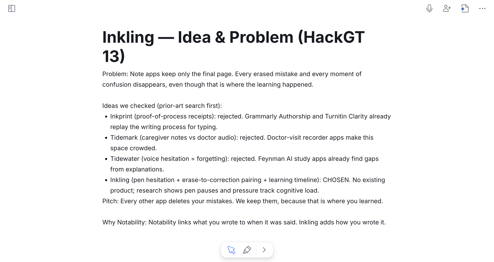
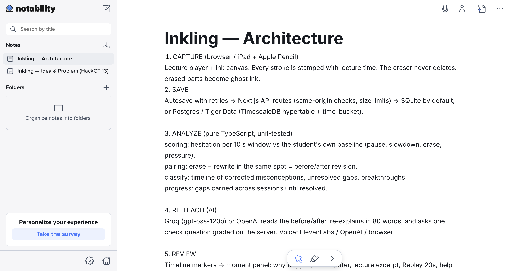
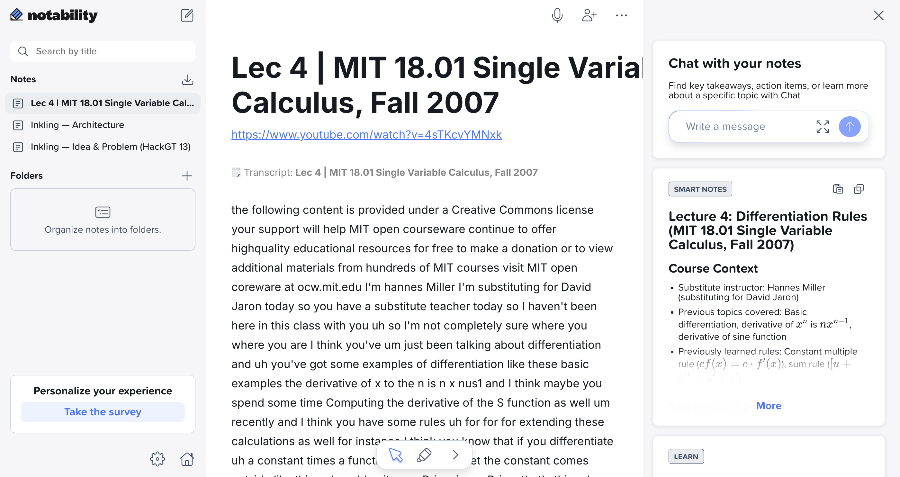
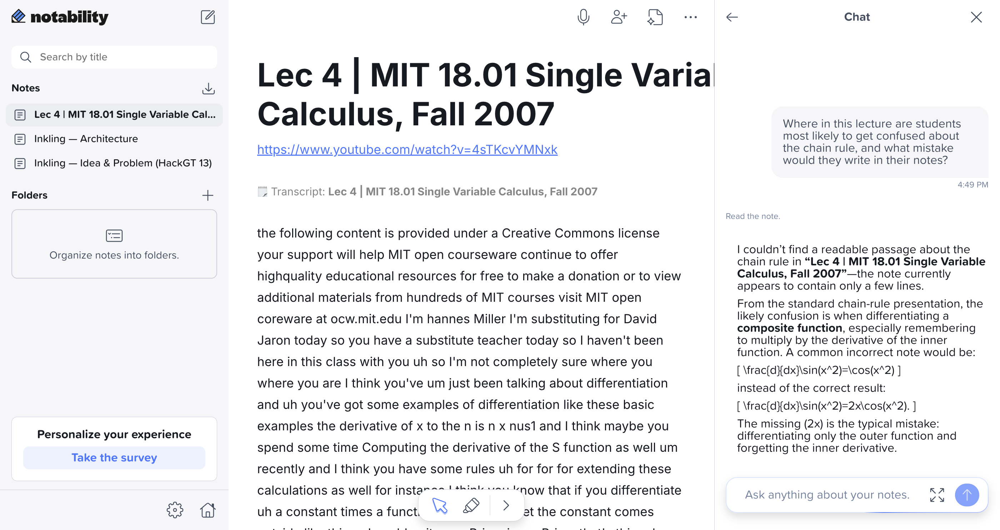
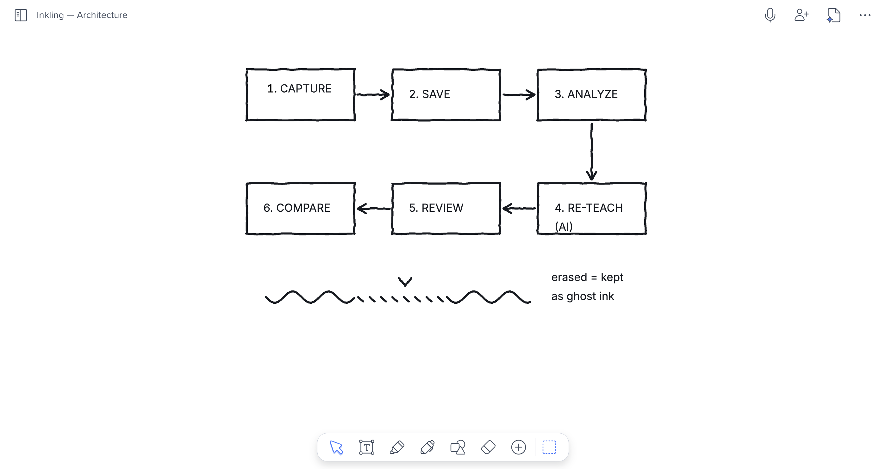

# Inkling: Devpost submission

> Placeholders to fill in before submitting: **[YouTube link]**.
> Live app: https://inklingapp.tech
> GitHub: https://github.com/PranavNagothu/Inkling

---

## Tagline

**Every other app deletes your mistakes. Inkling keeps them, because that is where you learned.**

(Short version, under 60 characters: *Notes that keep your erased mistakes and re-teach them.*)

---

## Inspiration

Maya is watching a calculus lecture on the chain rule. She writes `d/dx sin(x²) = cos(x²)`, pauses, erases it, and rewrites `cos(x²) · 2x`. A few minutes later, when the lecture compares the product rule with the chain rule, she slows down, erases her attempt, and goes quiet while the lecturer keeps talking. She never rewrites it.

Her final page looks clean and correct. It gives no sign that she briefly forgot the inner derivative, and no sign that she is still confused about when to use the product rule and when to use the chain rule. Every note app keeps only the final page, so the mistake she corrected and the gap she still has both disappear, even though that is where the learning happened.

Notability already links what you wrote to when it was said. I wanted to add *how* you wrote it: the hesitation, the erase and the rewrite.

## What it does

Inkling is a web note-taking canvas for lectures, designed for iPad and Apple Pencil (it also works with touch or a mouse).

- **Ghost ink.** The eraser never deletes. Erased handwriting stays on the page as dashed *ghost ink* that you can show or hide in review. Scribbling out and striking through also count as erasing.
- **Hesitation detection against your own baseline.** The first two minutes of your writing set a personal baseline. After that, each 10-second window is scored on writing slower than usual, erasing more than usual, and going quiet while the lecturer keeps talking. Pen pressure is also used when the pen reports it. A live meter shows *steady*, *slowing* or *stuck* while you write.
- **Erase-to-correction pairing.** Inkling groups erased strokes and looks for new writing in the same spot shortly afterwards. When the new ink overlaps the erased area enough, the two are paired as a before/after revision.
- **A learning timeline.** Every session becomes a strip of moments pinned to the lecture's clock: **misconception corrected**, **unresolved gap**, and **breakthrough**. **Replay 20 s** plays the lecture around any moment, and open gaps carry into your next session until they are resolved.
- **AI re-teaching.** For each moment, Inkling reads the before and after of your handwriting and what the lecturer was saying at that second. It then writes a short re-explanation (about 80 words) and one four-option check question. The answer is graded on the server. Answer correctly and the moment becomes a breakthrough.
- **10 languages, with voice.** Help cards, check questions and a spoken session recap are available in English, Spanish, Hindi, Mandarin Chinese, Arabic (right to left), French, Telugu, Korean, Vietnamese and Brazilian Portuguese. Any re-explanation can be read aloud.
- **Works with Notability.** *Compare with Notability* overlays Inkling's process on a Notability PDF export of the same notes, side by side or with a slider, and counts what the final page hides. *Export for Notability* exports a session as a PDF (ghost ink, labelled moments, and a page of re-explanations) that you can import back into Notability.
- **Class and teacher views.** *Where the class slowed down* shows class-wide erasing per 30 seconds of the lecture. The teacher view proposes the three stretches most worth re-teaching. It is anonymous by design: no names or handwriting leave the analysis, and a count only appears once at least three students share it (k ≥ 3).
- **Signal Lab and evaluation.** Every stroke is time-stamped to the lecture second it was written in. Every 10 seconds Inkling measures four pen signals against the student's own baseline (set by their first couple of minutes of writing): pausing while the lecturer keeps talking, writing slower than usual, erasing more than usual, and pen pressure when the device reports it. They combine into a smoothed "stuck" score over the whole lecture; each spike above the threshold becomes a moment on the timeline, linked to what the lecturer said, and gets a re-explanation and check question. Signal Lab charts all of this, so for every flagged moment you can see which signals fired and by how much. The detector was checked against hand labels of confusion **on a small labeled demo set, not a benchmark**, so a flagged moment is a strong hint, not a verdict.

## How we built it

Inkling was built solo at HackGT 13 as a **Next.js 16** app (React, TypeScript, Tailwind).

1. **Capture.** A lecture player and an ink canvas built on pointer events. Every stroke is stamped with the lecture time, and speed and pressure are recorded with it. Autosave retries on failure, and all writes are same-origin checked and size-limited.
2. **Save.** A single repository interface with two backends: SQLite by default (no setup), or Postgres on **Tiger Data** with TimescaleDB (`lib/dbPostgres.ts`). The same test suite runs on both, using embedded PGlite for Postgres.
3. **Analyze.** Pure TypeScript, unit-tested: `lib/scoring.ts` (per-window hesitation against the student's baseline), `lib/pairing.ts` (erase-to-rewrite overlap matching), `lib/classify.ts` (the timeline), and cross-session gap tracking.
4. **Re-teach.** One OpenAI-compatible client (`lib/ai/compat.ts`) with strict JSON-schema output, a repair retry, a 10-second deadline, per-session rate limits and a result cache. **Gemini** reads the handwriting and **Groq** writes the re-teaching. Lecture text and handwriting are quoted as untrusted data in every prompt, and the check question's answer never reaches the client before it is graded.
5. **Voice.** **ElevenLabs** reads the re-explanations and the session recap aloud (`lib/ai/tts.ts`). It falls back to the browser's voice.
6. **Review, compare, export.** The timeline and moment panel, the Notability PDF compare view (pdf.js), and the PDF export built with pdf-lib (`lib/notabilityExport.ts`).

**Demo-proof.** `npm run demo` seeds Maya's sessions and serves a production build that runs with no network at all: hand-checked AI fixtures, self-hosted fonts, and a browser voice. Every stage was verified with Playwright before moving on. The suite has 600+ unit and integration tests plus 60+ end-to-end tests, run on both SQLite and Postgres.

## How we used Notability Pro

I used Notability Pro during the build as my research and design notebook. I recorded the idea and the prior-art check there, wrote up and drew the architecture, studied the MIT lecture with YouTube-to-notes and Smart Notes, and used Note Chat to check that the demo's central mistake is the one students typically make.

| Screenshot | How Notability was used |
| --- | --- |
|  `01-idea-and-problem.png` | In a Notability note I recorded the problem ("note apps keep only the final page"), the four candidate ideas I checked against prior art (three rejected, each with the reason), why Inkling was chosen, and the pitch. |
|  `02-architecture.png` | I wrote up the pipeline in Notability: capture → save → analyze → re-teach → review, with the modules and design decisions behind each stage. It mirrors the codebase's module layout. |
|  `03-youtube-lecture-smart-notes.png` | I imported MIT 18.01 Lecture 4 from YouTube into Notability to get its transcript, and used Smart Notes to summarize the differentiation rules so I could find the chain-rule segment. |
|  `04-note-chat-chain-rule-mistake.png` | I asked Note Chat where students get confused about the chain rule. It named writing `d/dx sin(x²) = cos(x²)` and forgetting the inner `2x`, which is exactly Maya's 01:40 correction in the demo. (It said the note had little readable transcript, so it answered from the standard chain-rule presentation.) |
|  `05-architecture-diagram-canvas.png` | On the Notability canvas I drew the six-stage pipeline (with Compare added) and sketched the core ghost-ink idea: a stroke whose erased middle stays as a dashed line, labelled "erased = kept as ghost ink". |

**Inside the product:** *Compare with Notability* reads a Notability PDF export and overlays Inkling's process on the final page. *Export for Notability* (`lib/notabilityExport.ts`) produces a PDF you can import back into Notability, so the process sits next to your notes.

## Sponsor tech

**Notability ("Trust the Process").** Notability Pro was the planning and research tool for the build (see above), and the product is built to complement it: `components/CompareView.tsx` overlays a Notability PDF export with Inkling's ghost ink and moments and counts what the final page hides, and `lib/notabilityExport.ts` exports a session as a Notability-importable PDF.

**Tiger Data (TimescaleDB on Postgres).** When `DATABASE_URL` points at Tiger Cloud, `lib/dbPostgres.ts` enables TimescaleDB and turns `ink_samples` into a **hypertable** (one summary row per stroke: speed, pressure, ink length and erased, keyed on lecture time). `GET /api/sessions/<id>/ink-stats` computes per-window statistics with **`time_bucket`**, including median speed via `percentile_cont`. A real-time **continuous aggregate**, `ink_lecture_hotspots`, rolls up class-wide ink per 30 seconds of lecture, with a refresh policy every minute. It powers *Where the class slowed down* on Progress and the erasing row of the teacher heatmap. On plain Postgres the same queries fall back to `date_bin` and return identical results.

**Gemini API (`gemini-3.1-flash-lite`).** Gemini reads the handwriting. For each paired revision, the before and after crops are sent as images through Gemini's OpenAI-compatible endpoint (`lib/ai/gemini.ts`) with a strict JSON schema. It returns what changed, the likely misconception, and whether the edit was only cosmetic. That reading feeds the re-teaching prompt. Groq's own vision model is switched off in my configuration, so `lib/ai/select.ts` hands revision reading to the next configured provider, which is Gemini.

**Groq (`openai/gpt-oss-120b`).** Groq writes the re-teaching (`lib/ai/groq.ts`, `lib/ai/prompts.ts`): the ~80-word re-explanation, the four-option check question, concept labels, and translations of help cards and recaps into the other nine languages. Translation keeps the options in their original positions, so the server-side answer key still grades them. It uses strict structured outputs with low reasoning effort. The landing page's *Ask Inkling* assistant also runs on Groq (`openai/gpt-oss-20b` by default). It streams answers grounded in a vetted fact sheet (`landing/lib/knowledge.ts`) and falls back to an offline FAQ matcher.

**ElevenLabs (`eleven_flash_v2_5`).** ElevenLabs is the read-aloud voice for re-explanations and for the spoken session recap (`lib/ai/tts.ts`). Flash v2.5 covers nine of the ten languages, with `language_code` enforced, and Telugu routes to `eleven_v3`. Audio is cached per text hash, so replays cost nothing. Without a key, the app falls back to the browser's `speechSynthesis`.

## Challenges we ran into

- **Telling a correction from a mess.** Pairing an erase with its rewrite needed overlap thresholds, a short time window, and special handling for scribble-outs, strike-throughs, and an Undo that should not count as an erase.
- **"Slow" means slow *for you*.** A fixed threshold flags naturally slow writers all the time. Anchoring the baseline to each student's own first minutes of writing fixed that. The trade-off is that the baseline period itself is never flagged for hesitation.
- **Providers changing under me.** A Gemini model I started with was retired mid-hackathon, and Groq's vision model is a preview model. The AI layer is provider-agnostic with fallbacks, so both were configuration changes rather than rewrites.
- **Aligning time buckets.** TimescaleDB's `time_bucket` and Postgres's `date_bin` have different default origins. Lecture time is stored from a fixed epoch whose offset from Timescale's origin is a whole number of 30-second buckets, so both paths produce the same bars.
- **A demo that cannot fail on hackathon Wi-Fi.** Making the full demo work offline meant bundled fixtures, self-hosted fonts, a bundled pdf.js worker, and an iPad read-aloud watchdog.

## Accomplishments that we're proud of

- The core idea works end to end: erase, rewrite, see the moment on the timeline, get a re-explanation, answer the check question, and earn a breakthrough.
- Detection is inspectable. Signal Lab shows the signals behind every flagged moment, and the evaluation page reports precision and recall with a threshold sweep, stated plainly as results on a small labeled demo set, not a benchmark.
- Privacy by design: the app is local-first, keys stay on the server, the teacher view is k-anonymous, and handwriting and lecture text are treated as untrusted data in every prompt.
- One codebase with two storage backends and four AI providers, covered by 600+ unit and 60+ end-to-end tests.
- Built and shipped solo in one weekend.

## What we learned

- The process of writing carries signal the final page doesn't. Even simple features (speed against your own baseline, erase rate, silence while the lecture continues) line up with where a student got stuck.
- Structured output with strict schemas, server-side validators and a repair retry made LLM output dependable enough to grade a quiz with.
- A time-series database fits pen data well: continuous aggregates made class-wide hotspots a single query.
- Notability's YouTube-to-notes and Note Chat were a fast way to learn a lecture well enough to design a realistic demo around it.

## What's next

- Test with real students and real lectures, and grow the labeled set so detection accuracy can be measured beyond a demo set.
- A native iPadOS build with PencilKit for higher-resolution pressure and tilt data.
- Direct Notability integration beyond PDF, if an API becomes available.
- Spaced review: bring unresolved gaps back as check questions before the next exam.
- Instructor tools: let teachers annotate the stretches the class struggled with and push a re-explanation to everyone.

## Built with

`nextjs` `react` `typescript` `tailwindcss` `node.js` `sqlite` `postgresql` `timescaledb` `tiger-data` `pglite` `gemini` `groq` `gpt-oss` `elevenlabs` `openai-api` `pdf-lib` `pdf.js` `playwright` `vitest` `notability`

## Attributions

- **Lecture:** MIT OpenCourseWare, *18.01 Single Variable Calculus, Fall 2007*, Lecture 4, licensed **CC BY-NC-SA** (ocw.mit.edu). It was studied in Notability and can be used as an uploaded lecture in the app; `/about` shows this credit whenever it is. The bundled offline demo lecture is a synthetic six-minute chain-rule talk generated for this project.
- **Voice:** ElevenLabs (stock voice "Rachel" by default).
- **Models:** Google Gemini `gemini-3.1-flash-lite`; `openai/gpt-oss-120b` and `openai/gpt-oss-20b` served by Groq.
- **Planning and research:** Notability Pro.
- **Links:** Demo video [YouTube link] · Live app https://inklingapp.tech · Code https://github.com/PranavNagothu/Inkling

---

## Track-specific answers ("why we fit")

Paste the one that matches each track question.

**Oracle of the Deep (main track).**
Inkling looks beneath the surface of a page of notes. The final page shows what a student ended up with, and Inkling surfaces the hidden layer underneath: the erased attempts, the hesitations, and the misconceptions they corrected. From pen signals alone it predicts where a student was confused, then explains every prediction. Signal Lab shows which signals fired in each 10-second window, and the evaluation page measures the detector against hand labels with precision, recall, and a threshold sweep. We report those numbers honestly as results on a small labeled demo set, not a benchmark.

**Aramco, "A Marina's Mission" (alternative main track).** *[Check the prompt's wording and adjust.]*
Inkling helps a learner find exactly where their understanding broke down and fix it. It turns erased mistakes and hesitations into a timeline of corrected misconceptions, open gaps and breakthroughs, each linked to the lecture moment and re-taught in the student's own language (10 languages, with voice). It is built for access: it runs offline on a laptop and a tablet, keeps data local, and gives teachers an anonymous view of where a whole class got lost.

**Notability ("Trust the Process").**
Inkling is literally about trusting the process: it keeps the erased attempts and hesitations that every notes app throws away, because that is where learning happens. Notability Pro was part of my own process during the build. I recorded the idea and its prior-art check there, wrote up the architecture, drew the pipeline and the ghost-ink concept on the canvas, imported MIT 18.01 from YouTube to study the lecture with Smart Notes, and used Note Chat to confirm the typical chain-rule mistake that the demo is built around. The product also complements Notability: *Compare with Notability* overlays a Notability PDF export with the process it hides, and *Export for Notability* exports the session back as an importable PDF.

**Tiger Data.**
Pen data is a time series, so Inkling stores it that way. On Tiger Cloud, every stroke writes a summary row into the `ink_samples` hypertable, keyed on lecture time. Per-window statistics use `time_bucket`, and the real-time continuous aggregate `ink_lecture_hotspots` rolls up class-wide erasing per 30 seconds of lecture, powering *Where the class slowed down* and the teacher heatmap. All of this lives in `lib/dbPostgres.ts`, with versioned migrations, TLS by default for remote hosts, and a `date_bin` fallback so the same queries return identical results on plain Postgres.

**MLH: Best use of Gemini API.**
Gemini `gemini-3.1-flash-lite` reads students' handwriting. For every erase-and-rewrite, it receives the before and after crops and returns, under a strict JSON schema, what changed, the likely misconception, and whether the edit was only cosmetic. That reading is what lets the re-teaching say "you forgot the inner derivative" instead of offering generic help (`lib/ai/gemini.ts`, `lib/ai/select.ts`, `lib/ai/service.ts`).

**MLH: Best use of ElevenLabs.**
ElevenLabs `eleven_flash_v2_5` reads each re-explanation and the session recap aloud in the student's chosen language, with `language_code` enforced and `eleven_v3` for Telugu. That makes re-teaching accessible to English-language learners and to students who learn better by listening. Audio is cached per text, and the browser voice takes over when no key is set (`lib/ai/tts.ts`).

**MLH: Best use of Tiger Data.**
See the Tiger Data answer above: a hypertable of pen samples, `time_bucket` window statistics, and a real-time continuous aggregate behind the class hotspot chart, all in `lib/dbPostgres.ts`.

**MLH: .tech domain.**
Inkling is served at https://inklingapp.tech, a .tech domain from get.tech. It is hosted on Railway: one Next.js service with SQLite on a persistent volume, running the offline public demo (`DEMO_MODE`), which resets itself every 30 minutes (`docs/railway.md`).
